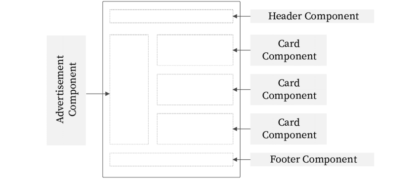
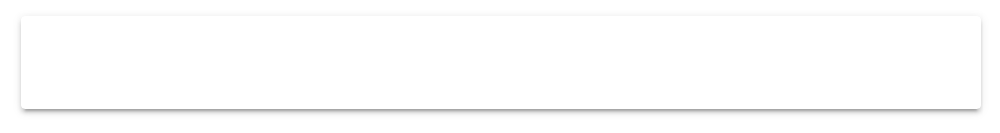

# Reactjs

## Section 1 - Main Concepts

### 1. Building Content with JSX

```tsx
const element = <h1>Hello, world!</h1>;
```

- It is called **JSX**, neither a string nor HTML.

- It is a syntax extension to JavaScript.
- **JSX** may remind you of a template language, but it comes with the full power of JavaScript.

#### 1.1. Why JSX?

React embraces the fact that rendering logic is inherently coupled with other UI logic: how events are handled, how the state changes over time, and how the data is prepared for display.

Instead of artificially separating *technologies* by putting markup and logic in separate files, React [separates *concerns*](https://en.wikipedia.org/wiki/Separation_of_concerns) with loosely coupled units called “components” that contain both.

#### 1.2. Embedding Expressions in JSX

We declare a variable called `name` and then use it inside JSX by wrapping it in `curly braces`:

```tsx
const name = 'Josh Perez';
const element = <h1>Hello, {name}</h1>;

ReactDOM.render(
  element,
  document.getElementById('root')
);
```

You can put any valid [JavaScript expression](https://developer.mozilla.org/en-US/docs/Web/JavaScript/Guide/Expressions_and_Operators#Expressions) inside the `curly braces` in JSX.

```tsx
function formatName(user) {
  return user.firstName + ' ' + user.lastName;
}

const user = {
  firstName: 'Harper',
  lastName: 'Perez'
};

const element = (
  <h1>
    Hello, {formatName(user)}!
  </h1>
);

ReactDOM.render(
  element,
  document.getElementById('root')
);
```

#### 1.3. Specifying Attributes with JSX

You may use **quotes** to specify string literals as attributes:

```tsx
const element = <div tabIndex="0"></div>;
```

You may also use **curly braces** to embed a JavaScript expression in an attribute:

```tsx
const element = </img>;
```

 You should either use **quotes** (for string values) or **curly braces** (for expressions), but not both in the same attribute.

#### 1.4. JSX Represents Objects

Babel compiles JSX down to `React.createElement()` calls.

These two examples are identical:

```tsx
const element = (
  <h1 className="greeting">
    Hello, world!
  </h1>
);

const element = React.createElement(
  'h1',
  {className: 'greeting'},
  'Hello, world!'
);
```

`React.createElement()` performs a few checks to help you write bug-free code but essentially it creates an object like this:

```js
// Note: this structure is simplified
const element = {
  type: 'h1',
  props: {
    className: 'greeting',
    children: 'Hello, world!'
  }
};
```

### 2. Structuring App with Components

#### 2.1 What is component?

You can think of a component as a small feature that makes up a piece of the user interface. If I were to describe a component within the scope of Facebook’s UI, A chat window would be a component, a comment feed would be another component, and a constantly updating friend list would represent yet another component.

Each of these components exist within the same space, yet interact independently from one another. Components have their own structure, their own methods and their own APIs. Components are also reusable and can be “pasted” into interfaces at will. The independent nature of components allows for developers to create a UI with many different moving parts.

Components let you split the UI into independent, reusable pieces, and think about each piece in isolation. This page provides an introduction to the idea of components.




#### 2.2. React component

Conceptually, components are like JavaScript functions. They accept arbitrary inputs (called “props”) and return React elements describing what should appear on the screen.

There are 2 way for coding a React component: ***Function and Class Components***

The simplest way to define a component is to write a JavaScript function:

```
function Welcome(props) {
  return <h1>Hello, {props.name}</h1>;
}
```

This function is a valid React component because it accepts a single “props” (which stands for properties) object argument with data and returns a React element. We call such components “function components” because they are literally JavaScript functions.

You can also use an [ES6 class](https://developer.mozilla.org/en/docs/Web/JavaScript/Reference/Classes) to define a component:

```
class Welcome extends React.Component {
  render() {
    return <h1>Hello, {this.props.name}</h1>;
  }
}
```

The above two components are equivalent from React’s point of view.

However, we will focus on coding **Function component.**

### 3. State, Props & Handling Events

#### 3.1. State & Props

**Props**

For parent-child communication, simply pass props.

Use **props** to pass data & event handlers down to your child components.

- are immutable
  - which lets React do fast reference checks
- are used to pass data down from your view-controller
  - your top level component
- have better performance
  - use this to pass data to child components

**State**

The heart of every React component is its `state`, an object that determines how that component renders & behaves. In other words, `state` is what allows you to create components that are dynamic and interactive.

Use **state** to store the data your current page needs in your controller-view.

- should be managed in your view-controller
  - your top level component
- is mutable
- has worse performance
- should not be accessed from child components
  - pass it down with props instead


#### 3.2. Handling Events

Handling events with React elements is very similar to handling events on DOM elements. There are some syntax differences:

- React events are named using camelCase, rather than lowercase.
- With JSX you pass a function as the event handler, rather than a string.

For example, the HTML:

```jsx
<button onclick="activateLasers()">
  Activate Lasers
</button>
```

is slightly different in React:

```jsx
<button onClick={activateLasers}>  
  Activate Lasers
</button>
```

**Passing Arguments to Event Handlers**

```jsx
// if your function have params
<button onClick={activateLasers(id)}>  
  Activate Lasers
</button>

// if you want to pass event into function
<button onClick={(e) => activateLasers(id, e)}>  
  Activate Lasers
</button>
```

### 4. Understanding Lifecycle

#### 4.1. Lifecycle concepts


We are going to explore the lifecycle methods of ReactJS. But, before moving ahead to React’s different lifecycle methods, we should understand what it is.

As we know, everything in this world follows a cycle (say humans or trees). We are born, grow, and then die. Almost everything follows this cycle in its life, and React components do as well. Components are created (mounted on the DOM), grow by updating, and then die (unmount on DOM). This is referred to as **a component lifecycle.**

Each component has several “lifecycle methods” that you can override to run code at particular times in the process. **You can use [this lifecycle diagram](https://projects.wojtekmaj.pl/react-lifecycle-methods-diagram/) as a cheat sheet.** In the list below, commonly used lifecycle methods are marked as **bold**. The rest of them exist for relatively rare use cases.

- **Mounting:** These methods are called in the following order when an instance of a component is being created and inserted into the DOM

- **Updating: **An update can be caused by changes to props or state. These methods are called in the following order when a component is being re-rendered

- **Unmounting:** This method is called when a component is being removed from the DOM

#### 4.2. Implementing with hooks


The **Effect Hook** lets you perform side effects in function components

By using this Hook, you tell React that your component needs to do something after render. React will remember the function you passed (we’ll refer to it as our “effect”), and call it later after performing the DOM updates. In this effect, we set the document title, but we could also perform data fetching or call some other imperative API.

**useEffect** runs both after the first render *and* after every update. Instead of thinking in terms of “mounting” and “updating”, you might find it easier to think that effects happen “after render”. React guarantees the DOM has been updated by the time it runs the effects.

```
import React, { useState, useEffect } from 'react';
function Example() {
  const [count, setCount] = useState(0);
  useEffect(() => {   
  	document.title = `You clicked ${count} times`;  
  });
    
  return (
    <div>
      <p>You clicked {count} times</p>
      <button onClick={() => setCount(count + 1)}>
        Click me
      </button>
    </div>
  );
}
```

> Tip
>
> If you’re familiar with React class lifecycle methods, you can think of `useEffect` Hook as `componentDidMount`, `componentDidUpdate`, and `componentWillUnmount` combined.

There are two common kinds of side effects in React components: those that don’t require cleanup, and those that do. Let’s look at this distinction in more detail.

##### 4.2.1. Effects Without Cleanup

Sometimes, we want to **run some additional code after React has updated the DOM.** Network requests, manual DOM mutations, and logging are common examples of effects that don’t require a cleanup. We say that because we can run them and immediately forget about them. Let’s compare how classes and Hooks let us express such side effects.

##### 4.2.2. Effects with Cleanup

Earlier, we looked at how to express side effects that don’t require any cleanup. However, some effects do. For example, **we might want to set up a subscription** to some external data source. In that case, it is important to clean up so that we don’t introduce a memory leak! Let’s compare how we can do it with classes and with Hooks.

You might be thinking that we’d need a separate effect to perform the cleanup. But code for adding and removing a subscription is so tightly related that `useEffect` is designed to keep it together. If your effect returns a function, React will run it when it is time to clean up:

```
useEffect(() => {
  function handleStatusChange(status) {
    setIsOnline(status.isOnline);
  }

  ChatAPI.subscribeToFriendStatus(props.friend.id, handleStatusChange);
  return () => {
    ChatAPI.unsubscribeFromFriendStatus(props.friend.id, handleStatusChange);
  };
});
```

**Why did we return a function from our effect?** This is the optional cleanup mechanism for effects. Every effect may return a function that cleans up after it. This lets us keep the logic for adding and removing subscriptions close to each other. They’re part of the same effect!

**When exactly does React clean up an effect?** React performs the cleanup when the component unmounts. However, as we learned earlier, effects run for every render and not just once. This is why React *also* cleans up effects from the previous render before running the effects next time.

### 5. Rendering Elements

#### 5.1. Conditional Rendering

Conditional rendering in React isn't difficult. In JSX - the syntax extension used for React - you can use plain JavaScript which includes if else statements, ternary operators, switch case statements, and much more. In a conditional render, a React component decides based on one or several conditions which DOM elements it will return. For instance, based on some logic it can either return a list of items or a text that says "Sorry, the list is empty". When a component has a conditional rendering, the appearance of the rendered component differs based on the condition. The article aims to be an exhaustive list of options for conditional renderings in React and best practices for these patterns.

##### 5.1.1. Conditional Rendering in React: if 

The most basic conditional rendering logic in React is done with a single **if** statement. Imagine you don't want to render something in your *React component*, because it doesn't have the necessary *React props* available. For instance, a *List component in React* shouldn't render the list HTML elements in a view if there is no list of items in the first place. You can use a plain JavaScript if statement to return earlier (guard pattern):

```jsx
const users = [
  { id: '1', firstName: 'Robin', lastName: 'Wieruch' },
  { id: '2', firstName: 'Dennis', lastName: 'Wieruch' },
];
 
function App() {
  return (
    <div>
      <h1>Hello Conditional Rendering</h1>
      <List list={users} />
    </div>
  );
}
 
function List({ list }) {
  if (!list) {
    return null;
  }
 
  return (
    <ul>
      {list.map(item => (
        <Item key={item.id} item={item} />
      ))}
    </ul>
  );
}
 
function Item({ item }) {
  return (
    <li>
      {item.firstName} {item.lastName}
    </li>
  );
}
```

Try it yourself by setting `users` to null oder undefined. If the information from the props is null or undefined, the React component returns null in the conditional rendering. There, a React component that returns null instead of JSX will render nothing.

##### 5.1.2. Conditional Rendering in React: if else

Let's move on with the previous example to learn about **if else** statements in React. If there is no list, we render nothing and hide the HTML as we have seen before with the single if statement. However, you may want to show a text as feedback for your user when the list is empty for a better user experience. This would work with another single if statement, but we will expand the example with an if else statement instead:

```jsx
function List({ list }) {
  if (!list) {
    return null;
  }
 
  if (!list.length) {
    return <p>Sorry, the list is empty.</p>;
  } else {
    return (
      <div>
        {list.map(item => (
          <Item item={item} />
        ))}
      </div>
    );
  }
}
```

Now, the List component renders either nothing, a text, or the list of items based on some JavaScript logic. Even though the previous example shows you how to use if else statements in React, I suggest to use single if statements every time you want to guard your main return (here: returning the list) as a best practice:

```jsx
function List({ list }) {
  if (!list) {
    return null;
  }
 
  if (!list.length) {
    return <p>Sorry, the list is empty.</p>;
  }
 
  return (
    <div>
      {list.map(item => (
        <Item item={item} />
      ))}
    </div>
  );
}
```

This is way more readable than the previous if else conditional rendering. All the guards are neatly aligned as single if statements before the main return statement which can be interpreted as an implicit else statement too. Still, none of the if and else statements were used inside the return statement yet.

##### 5.1.3. Conditional Rendering in React: ternary

It's true that we can use JavaScript in JSX, but it becomes difficult when using statements like **if, else, and switch case within JSX**. There is no real way to inline it. Another way to express an if else statement in JavaScript is the **[ternary operator](https://developer.mozilla.org/en/docs/Web/JavaScript/Reference/Operators/Conditional_Operator)**:

```jsx
// if else
function getFood(isVegetarian) {
  if (isVegetarian) {
    return 'tofu';
  } else {
    return 'fish';
  }
}
 
// ternary operator
function getFood(isVegetarian) {
  return isVegetarian ? 'tofu' : 'fish';
}
```

For instance, imagine your component shows either a preview or edit mode. The condition is a JavaScript boolean which comes in as React prop. You can use the boolean to decide which element you want to conditionally render:

```jsx
function Recipe({ food, isEdit }) {
  return (
    <div>
      {food.name}
 
      {isEdit ? (
        <EditRecipe food={food} />
      ) : (
        <ShowRecipe food={food} />
      )}
    </div>
  );
}
```

The parentheses `()` around both implicit return statements in the ternary operator enable you to return a single or multiple HTML elements or React components from there. If it's just a single element though, you can omit the parentheses.

Note: Sometimes you want to wrap multiple lines of elements with a div element as one block though. Anyway, try to keep it lightweight. If the wrapper between the `()` grows too big, consider extracting it as a component as shown in the example.

The ternary operation makes the conditional rendering in React not only more concise, but gives you an easy way to **inline the conditional rendering in your return**. This way, only a one part of your JSX is conditionally rendered, while other parts can stay intact without any condition.

##### 5.1.4. Conditional Rendering in React: &&

It happens often that you want to *render either an element or nothing*. You have learned that a simple if condition helps with that issue. However, then again you want to be able to inline the condition like a ternary operator. Take the following loading indicator component which uses a conditional ternary operator to return either the element or nothing:

```jsx
function LoadingIndicator({ isLoading }) {
  return <div>{isLoading ? <p>Loading...</p> : null}</div>;
}
```

This works just fine and you are done inlining the condition in your JSX. However, there exists an alternative way that omits the necessity to return null.

The **logical && operator** helps you to make conditions that would return null more concise. In JavaScript, a `true && 'Hello World'` always evaluates to 'Hello World'. A `false && 'Hello World'` always evaluates to false:

```jsx
const result = true && 'Hello World';
console.log(result);
// Hello World
 
const result = false && 'Hello World';
console.log(result);
// false
```

In React, you can make use of this behaviour. If the condition is true, the expression after the logical && operator will be the output. If the condition is false, React ignores and skips the expression:

```jsx
function LoadingIndicator({ isLoading }) {
  return <div>{isLoading && <p>Loading...</p>}</div>;
}
```

That's your way to go when you want to **return nothing or an element inside JSX**. It's also called short-circuit evaluation which makes it even more concise than a ternary operator.

##### 5.1.5. Conditional Rendering in React: switch case

Now there might be cases where you have multiple conditional renderings. Take for example a notification component that renders an error, warning, or info component based on a status string:

```jsx
function Notification({ text, status }) {
  if (status === 'info') {
    return <Info text={text} />;
  }
 
  if (status === 'warning') {
    return <Warning text={text} />;
  }
 
  if (status === 'error') {
    return <Error text={text} />;
  }
 
  return null;
}
```

You can use a **switch case operator** for *multiple conditional renderings*:

```jsx
function Notification({ text, status }) {
  switch (status) {
    case 'info':
      return <Info text={text} />;
    case 'warning':
      return <Warning text={text} />;
    case 'error':
      return <Error text={text} />;
    default:
      return null;
  }
}
```

It's wise to use the default for the switch case operator, because a React component always has to return an element or null. If a component has a conditional rendering based on a string, it makes sense to describe the interface of the component with TypeScript:

```jsx
type Status = 'info' | 'warning' | 'error';
 
type NotificationProps = {
  text: string;
  status: Status;
};
 
function Notification({ text, status }: NotificationProps) {
  switch (status) {
    case 'info':
      return <Info text={text} />;
    case 'warning':
      return <Warning text={text} />;
    case 'error':
      return <Error text={text} />;
    default:
      return null;
  }
}
```

A switch case is a good start for multiple conditional renderings. But it comes with the same drawbacks like an if else statement. A switch case cannot be used within JSX; can it? Actually it's possible with a conditional rendering function which is self invoking:

```jsx
function Notification({ text, status }) {
  return (
    <div>
      {(function() {
        switch (status) {
          case 'info':
            return <Info text={text} />;
          case 'warning':
            return <Warning text={text} />;
          case 'error':
            return <Error text={text} />;
          default:
            return null;
        }
      })()}
    </div>
  );
}
```

Optionally make the switch case more concise with an conditional rendering arrow function:

```jsx
function Notification({ text, status }) {
  return (
    <div>
      {(() => {
        switch (status) {
          case 'info':
            return <Info text={text} />;
          case 'warning':
            return <Warning text={text} />;
          case 'error':
            return <Error text={text} />;
          default:
            return null;
        }
      })()}
    </div>
  );
}
```

In conclusion, the switch case operator helps you to have multiple conditional renders. But is it the best way to do that? Let's see how we can have multiple conditional renderings with enums instead.

#### 5.2. Lists and Keys

##### 5.2.1. **Rendering Multiple Components**

Below, we loop through the `numbers` array using the JavaScript [`map()`](https://developer.mozilla.org/en-US/docs/Web/JavaScript/Reference/Global_Objects/Array/map) function. We return a `<li>` element for each item. Finally, we assign the resulting array of elements to `listItems`:

```
const numbers = [1, 2, 3, 4, 5];
const listItems = numbers.map((number) =>  <li>{number}</li>);
```

We include the entire `listItems` array inside a `<ul>` element, and render it to the DOM:

```
ReactDOM.render(
  <ul>{listItems}</ul>,  document.getElementById('root')
);
// This code displays a bullet list of numbers between 1 and 5.
```

##### 5.2.2. Basic List Component

Usually you would render lists inside a component.

We can refactor the previous example into a component that accepts an array of `numbers` and outputs a list of elements.

```
function NumberList(props) {
  const numbers = props.numbers;
  const listItems = numbers.map((number) =>    <li>{number}</li>  );  return (
    <ul>{listItems}</ul>  );
}

const numbers = [1, 2, 3, 4, 5];
ReactDOM.render(
  <NumberList numbers={numbers} />,  document.getElementById('root')
);
```

##### 5.2.3. Keys

Keys help React identify which **items have changed, are added, or are removed**. Keys should be given to the elements inside the array to give the elements a stable identity.

The best way to pick a key is to use a string that **uniquely identifies** a list item among its siblings.

```
const numbers = [1, 2, 3, 4, 5];
const listItems = numbers.map((number) =>
  <li key={number.toString()}>    
    {number}
  </li>
);
```

**Most often you would use IDs** from your data as keys:

```
const todoItems = todos.map((todo) =>
  <li key={todo.id}>    {todo.text}
  </li>
);
```

When you don’t have stable IDs for rendered items, you **may use the item index as a key** as a last resort:

```
const todoItems = todos.map((todo, index) =>
  // Only do this if items have no stable IDs  
  <li key={index}>    
    {todo.text}
  </li>
);
```

**Notes:**

- Extracting Components with Keys

- Keys Must Only Be Unique Among Siblings

### 6. Components Interactions

#### 6.1. From Parent to Child Component with Props

Some case is that component won’t be useful unless you can pass data to it, such as the title and content of the specific post we want to display. That’s where props come in.

**Props** are custom attributes you can register on a component. When a value is passed to a prop attribute, it becomes a property on that component instance. 

A component can have as **many props** as you’d like and by default, any value can be passed to any prop.

Once a prop is registered, you can pass data to it as a custom attribute.

```
function Welcome(props) {
  return <h1>Hello, {props.name}</h1>;
}

function App() {
  return (
    <div>
      <Welcome name="Sara" />
      <Welcome name="Cahal" />
      <Welcome name="Edite" />
    </div>
  );
}
```

#### 6.2. Form Child to Parent Component with Callbacks

For a child to talk back to a parent (unacceptable, I know!), it must first receive a mechanism to communicate back from its parent. 

As we learned, parents pass data to children through `props`. A "special" prop of type `function` can be passed down to a child. At the time of a relevant event (eg, user interaction) the child can then call this function as a callback.

Let's say that a book can be edited from a `BookTitle` component:

```
function BookTitle(props) {
  return (
    <label>
      Title: 
      <input onChange={props.onTitleChange} value={props.title} />
    </label>
  )
}
```

It receives a `onTitleChange` function in the `props`, sent from its parent. It binds this function to the `onChange` event on the `<input />` field. When the input changes, it will call the `onTitleChange` callback, passing the change `Event` object.

Because the parent, `BookEditForm`, has reference to this function, it can receive the arguments that are passed to the function:

```
import React, { useState } from 'react'

function BookEditForm(props) {
  const [title, setTitle] = useState(props.book.title)
  function handleTitleChange(evt) {
    setTitle(evt.target.value)
  }
  return (
    <form>
      <BookTitle onTitleChange={handleTitleChange} title={title} />
    </form>
  )
}
```

In this case, the parent passed `handleTitleChange`, and when it's called, it sets the internal state based on the value of `evt.target.value` -- a value that has come as a callback argument from the child component.

### 7. Fetch Data from APIs

### 8. React Router

We will talk about how to router in reactjs, we need to identify which version of router installed.
Now, there are two different versions with different style coding `v6` and `v5`.
However, `v6` is **beta**, not stable, so we will learn how to route our app with `v5`.

#### 8.1. Quick Start

```sh
npm install react-router-dom
```

Init `Router` into the project.
```jsx
import React from "react";
import { BrowserRouter as Router } from "react-router-dom";
import ReactDOM from "react-dom";

ReactDOM.render(
  <Router>
    <App/>
  </Router>,
  node
);
```
We use `<BrowserRouter>` because it 's a `<Router>` that uses the HTML5 history API (pushState, replaceState and the popstate event) to keep your UI in sync with the URL.
From now, we can route our app.

#### 8.2. Basic Route
The Route component is perhaps the most important component in React Router to understand and learn to use well. Its most basic responsibility is to render some UI when its path matches the current URL.

Very often we will need to map routes with the given pattern to the same component. And `path` will help use to do this. 
Define a basic route will be like this:
```jsx
 <Route path="/news">
 	 <NewsFeed />
 </Route>
```
it's equivalent to:
```jsx
 <Route path="/news" component={NewsFeed}></Route>
```
```jsx
import React from "react";
import ReactDOM from "react-dom";
import { BrowserRouter as Router, Route } from "react-router-dom";

ReactDOM.render(
  <Router>
    <div>
      <Route exact path="/">
        <Home />
      </Route>
      <Route path="/news">
        <NewsFeed />
      </Route>
    </div>
  </Router>,
  node
);
```
**Notes:** `exact` prop of `Route`

When `true`, will only match if the path matches the `location.pathname` *exactly*.

```jsx
<Route exact path="/one">
  <About/>
</Route>
```

|  path  | location.pathname |  exact  | matches? |
| :----: | :---------------: | :-----: | :------: |
| `/one` |    `/one/two`     | `true`  |    no    |
| `/one` |    `/one/two`     | `false` |   yes    |

#### 8.3. Dynamic Route Matching

##### 8.3.1. How to use

A dynamic segment is denoted by a colon `:`. When a route is matched, the value of the dynamic segments will be exposed in `useParams()` in every component. 

```jsx
<Route path="/users/:id" component={Users}></Route>
```

```jsx
import React from "react";
import ReactDOM from "react-dom";
import { useParams } from "react-router-dom";

const Users = () => {
	const {id} = useParams(); // => this is how to expose the params of a route.
  
  return (
    <Router>
      <h1>User: {id}</h1>
      </div>
    </Router>
  )
);
```

Example:

| pattern                       | matched path        | $route.params                          |
| ----------------------------- | ------------------- | -------------------------------------- |
| /user/:username               | /user/evan          | `{ username: 'evan' }`                 |
| /user/:username/post/:post_id | /user/evan/post/123 | `{ username: 'evan', post_id: '123' }` |

**Notes**: one thing to note when using routes with params is that when the user navigates from `/user/foo` to `/user/bar`, **the same component instance will be reused**. Since both routes render the same component, this is more efficient than destroying the old instance and then creating a new one. **However, this also means that the lifecycle hooks of the component will not be called**.

##### 8.3.2. Catch all / 404 Not found Route

Regular params will only match characters in between url fragments, separated by `/`. If we want to match **anything**, we can use the asterisk (`*`):

```jsx
<Route path="*" component={NoMatch}/>
```

When using *asterisk* routes, make sure to correctly order your routes so that *asterisk* ones are at the end. 

#### 8.4. Switch Routes

Renders the first child `<Route>` or `<Redirect>` that matches the location.

**How is this different than just using a bunch of `<Route>`s?**

`<Switch>` is unique in that it renders a route *exclusively*. In contrast, every `<Route>` that matches the location renders *inclusively*. Consider these routes:

```jsx
import { Route } from "react-router";

let routes = (
  <div>
    <Route path="/about">
      <About />
    </Route>
    <Route path="/:user">
      <User />
    </Route>
    <Route>
      <NoMatch />
    </Route>
  </div>
);
```

If the URL is `/about`, then `<About>`, `<User>`, and `<NoMatch>` will all render because they all match the path. 

Occasionally, however, we want to pick only one `<Route>` to render. If we’re at `/about` we don’t want to also match `/:user` (or show our “404” page). Here’s how to do it with `Switch`:

```jsx
import { Route, Switch } from "react-router";

let routes = (
  <Switch>
    <Route exact path="/">
      <Home />
    </Route>
    <Route path="/about">
      <About />
    </Route>
    <Route path="/:user">
      <User />
    </Route>
    <Route>
      <NoMatch />
    </Route>
  </Switch>
);
```

Now, if we’re at `/about`, `<Switch>` will start looking for a matching `<Route>`. `<Route path="/about"/>` will match and `<Switch>` will stop looking for matches and render `<About>`. Similarly, if we’re at `/michael` then `<User>` will render.

#### 8.5. Nested Routes

Real app UIs are usually composed of components that are nested multiple levels deep. It is also very common that the segments of a URL corresponds to a certain structure of nested components, for example:

```js
/user/profile                     /user/posts
+------------------+                  +-----------------+
| User             |                  | User            |
| +--------------+ |                  | +-------------+ |
| | Profile      | |  +------------>  | | Posts       | |
| |              | |                  | |             | |
| +--------------+ |                  | +-------------+ |
+------------------+                  +-----------------+
```

`Switch ` in `Switch` will help us for nested routes.  

```jsx
export default function App() {
  return (
    <Router>
      <div>
        <Switch>
          <Route exact path="/">
            <Home />
          </Route>
          <Route path="/user">
            <User />
          </Route>
        </Switch>
      </div>
    </Router>
  );
}

function User() {
  let { path } = useRouteMatch();

  return (
    <div>
      <Switch>
        <Route path={`${path}/profile`}>
          <Profile />
        </Route>
        <Route path={`${path}/posts`}>
          <Profile />
        </Route>
      </Switch>
    </div>
  );
}
```

#### 8.6. Navigation

##### 8.6.1 Navigation with React Dom

`<Link>` provides declarative, accessible navigation around your application.

```jsx
<Link to="/about">About</Link>
```

`to` prop of Link can be `string`, `object`, `function`.

- String

  ```jsx
  <Link to="/courses?sort=name" />
  ```

- Object

  An object that can have any of the following properties:

  - `pathname`: A string representing the path to link to.
  - `search`: A string representation of query parameters.
  - `hash`: A hash to put in the URL, e.g. `#a-hash`.
  - `state`: State to persist to the `location`.

  ```jsx
  <Link
    to={{
      pathname: "/courses",
      search: "?sort=name",
      hash: "#the-hash",
      state: { fromDashboard: true }
    }}
  />
  ```

- Function

  ```jsx
  <Link to={location => ({ ...location, pathname: "/courses" })} />
  <Link to={location => `${location.pathname}?sort=name`} />
  ```

##### 8.6.2. Programmatic Navigation

Aside from using `<Link>` to create anchor tags for declarative navigation, we can do this programmatically using a hook named `useHistory`.

It gives you access to the [`history`](https://reactrouter.com/web/api/history) instance that you may use to navigate.

```jsx
import { useHistory } from "react-router-dom";

function HomeButton() {
  let history = useHistory();

  function handleClick() {
    history.push("/home");
  }

  return (
    <button type="button" onClick={handleClick}>
      Go home
    </button>
  );
}

```

| Declarative       | Programmatic        |
| ----------------- | ------------------- |
| `<Link to={...}>` | `history.push(...)` |

`useHistory` can also push an object `History`:

```js
{
    pathname: "/courses",
    search: "?sort=name",
    hash: "#the-hash",
    state: { fromDashboard: true }
}
```

#### 8.7. Relative link paths

The first segment name can be prepended with /, ./, or ../.

| Current Path       | First segment                                                | New Path        |
| ------------------ | ------------------------------------------------------------ | --------------- |
| `/users/1`         | `history.push("2")`<br />`<Link to={"2"}>`                   | `/users/2`      |
| `/users/1`         | `history.push("./2")`<br />`<Link to={"./2"}>`               | `/users/2`      |
| `/users/1`         | `history.push("/new-page")`<br />`<Link to={"/new-page"}>`   | `/new-page`     |
| `/users/1/posts/2` | `history.push("../cards")`<br />`<Link to={"../cards"}>`     | `users/1/cards` |
| `/users/1/posts/2` | `history.push("../../cards")`<br />`<Link to={"../../cards"}>` | `users/cards`   |
| `/users/1/posts/2` | `history.push("../../../cards")`<br />`<Link to={"../../../cards"}>` | `/cards`        |

### 9. Children in JSX

In JSX expressions that contain both an opening tag and a closing tag, the content between those tags is passed as a special prop: `props.children`. There are several different ways to pass children:

#### 9.1. Default slot projection

```jsx
const App = () => {
  return (
    <div>
      <Card>A simple card</Card>
    </div>
  )
}
```

So we will leverage `children` props to render anything that will be provided between `<Card>{PROJECTED CONTENT}</Card>` tags.

```jsx
const Card = (props) => {
  return <div className="card">{props.children}</div>
}
```

Which renders our card:


All good! But what if user forgets to provide children ?

```
const App = () => {
  return (
    <div>
      <Card></Card>
    </div>
  )
}
```

Well, we’ll get no compile nor runtime errors and our app will render with empty Card …



#### 9.2. Children as an object map (named slots projection)

Now let’s extends our Card API, by providing additional API like:

- header
- media
- content
- actions

Your initial thoughts about this API might look like following:

```jsx
<Card>
  <CardHeader title="Shiba Inu">...</CardHeader>
  <CardMedia src="examples/shiba2.jpg"/>
  <CardContent>
    <p>
      The Shiba Inu is the smallest of the six original ...
    </p>
  </CardContent>
  <CardActions>
    <Button>Like</Button>
    <Button>Share</Button>
  <CardActions>
</Card>
```

Which is old good compound components pattern, which of course works, but in my opinion this is too much churn which is nicely solved with so called `named slots projection` API provided natively within browser via [Shadow DOM (WebComponents)](https://developers.google.com/web/fundamentals/web-components/shadowdom#composition_slot). We can achieve similar pattern in React by passing an Object map as children prop ( That's the beauty of React, it's mostly "just JavaScript" ).

So instead our API for Card could look like following:

```jsx
<Card>
  {{
    header: 'Shiba Inu',
    media: ,
    content: (
      <p>The Shiba Inu is the smallest of the six original ...</p>
    ),
    actions: (
      <>
        <button>Like</button>
        <button>Share</button>
      </>
    ),
   }}
</Card>
```

With Card implementation:


We’re constraining children prop to be required and to have shape of an object map. Also TypeScript will give us nice intellisense and compile time errors if we missed something, without need to browse docs of `Card` component.


#### 9.3. `props.children` as a function ( known also as render props pattern )

The truth is that I kind of like the syntax with `props.children`. It becomes obvious that the expression is used for rendering the children of the component.

```jsx
<TodoList
  todos={ todos }
  renderTodo={
    todo => isCompleted(todo) ? <b>{ todo.label }</b> : todo.label
  } />
```

```jsx
function TodoList(props) {
  const renderTodo = (todo, i) => {
    return (
      <li key={ i }>
        { props.children(todo) }
      </li>
    );
  }
  return (
    <section className='main-section'>
      <ul className='todo-list'>{ props.todos.map(renderTodo)}</ul>
    </section>
  );
}

function App() {
  const todos = [
    { label: 'Write tests', status: 'done' },
    { label: 'Sent report', status: 'progress' },
    { label: 'Answer emails', status: 'done' }
  ];
  var isCompleted = todo => todo.status === 'done';

  return (
    <TodoList todos={ todos }>
      { todo => isCompleted(todo) ? <b>{ todo.label }</b> : todo.label }
    </TodoList>
  );
}
```

