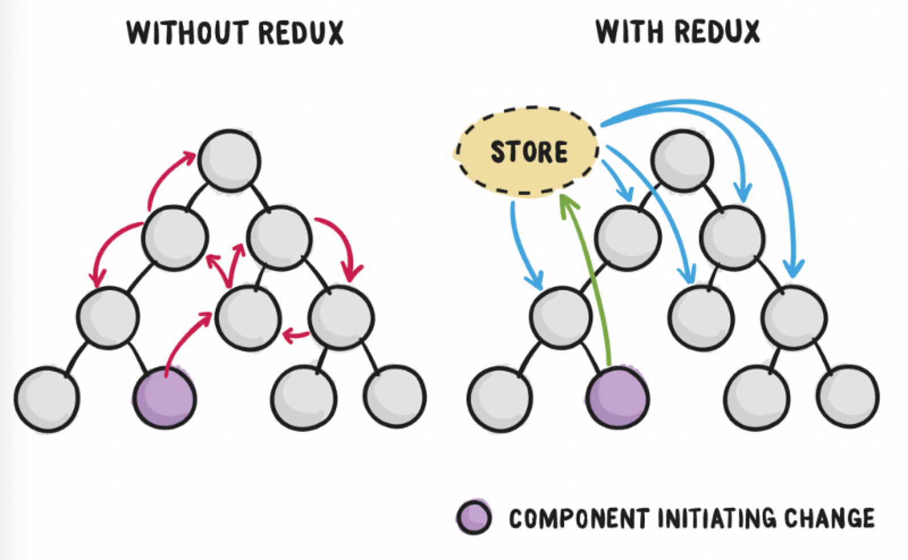
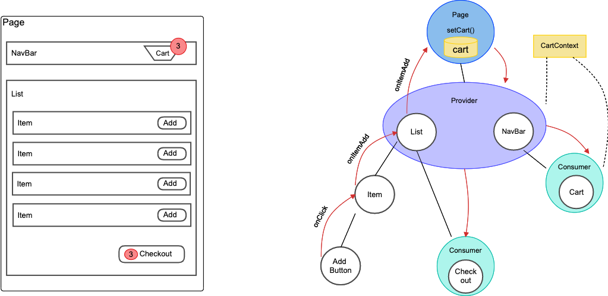
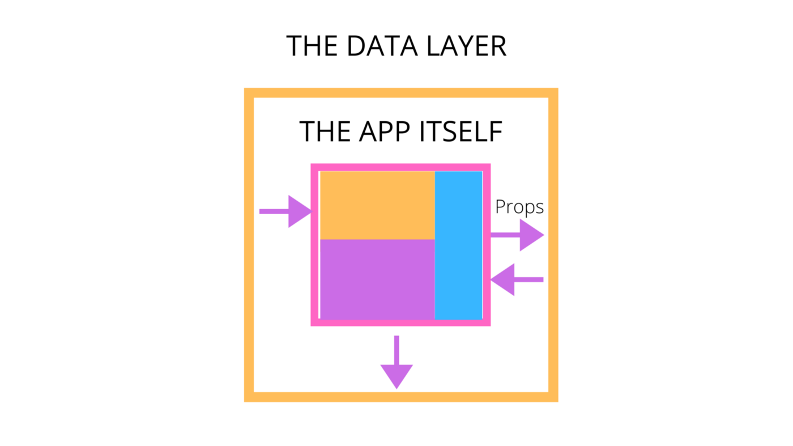
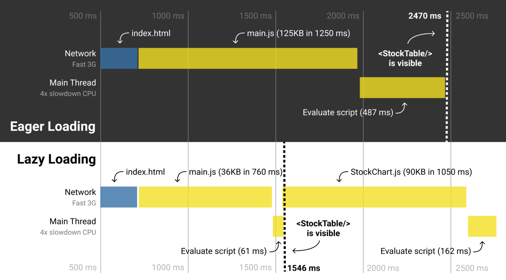

# Reactjs

## Section 2 - Advanced Guides

### 1. Redux



#### 1.1. Getting Started with Redux

Redux is a predictable state container designed to help you write JavaScript apps that behave consistently across client, server, and native environments.

While it’s mostly used as **a state management tool** with React, you can use it with any other JavaScript framework or library. It’s lightweight at 2KB (including dependencies), so you don’t have to worry about it making your application’s asset size bigger.

With Redux, **the state of your application** is kept in a store, and **each component can access any state** that it needs from this store.

#### 1.2. When to use Redux

- Redux allows you to **manage your app’s state** in a single place and keep changes in your app more predictable and traceable. 

- It makes it easier to reason about changes occurring in your app. But all of these benefits come with tradeoffs and constraints. 

#### 1.3. What is state management in Redux?

**State management** is essentially a way to facilitate communication and sharing of data across components. It creates a tangible data structure to represent the state of your app that you can read from and write to. That way, you can see otherwise invisible states while you’re working with them.

Basically, the state will have to be lifted up to the nearest parent component and to the next until it gets to an ancestor that is common to both components that need the state, and then it is passed down. This makes the state difficult to maintain and less predictable. It also means passing data to components that do not need it.

It’s clear that state management gets messy as the app gets complex. This is **why you need a state management tool like Redux** that makes it easier to maintain these states.

#### 1.4. How Redux works

The way Redux works is simple. There is a central store that holds the entire state of the application. Each component can access the stored state without having to send down props from one component to another.

There are three building parts: **actions, store, and reducers**. Let’s briefly discuss what each of them does. This is important because they help you understand the benefits of Redux and how it’s to be used. We’ll be implementing a similar example to the login component above but this time in Redux.

##### 1.4.1. Actions in Redux

Simply put, actions are events. They are the only way you can send data from your application to your Redux store. The data can be from user interactions, API calls, or even form submissions.

Actions are sent using the `store.dispatch()` method. Actions are plain JavaScript objects, and they must have a type property to indicate the type of action to be carried out. They must also have a payload that contains the information that should be worked on by the action. Actions are created via an action creator.

Here’s an example of an action that can be carried out during login in an app:

```jsx
{ 
  type: "LOGIN",
  payload: {
    username: "foo",
    password: "bar"
  }
}
```

Here is an example of its action creator:

```jsx
const setLoginStatus = (name, password) => {
  return {
    type: "LOGIN",
    payload: {
      username: "foo",
      password: "bar"
    }
  }
}
```

As explained earlier, the action must contain the type property and then the other payload to be stored.

##### 1.4.2. Reducers in Redux

Reducers are pure functions that take the current state of an application, perform an action, and return a new state. These states are stored as objects, and they specify how the state of an application changes in response to an action sent to the store.

It is based on the `reduce` function in JavaScript, where a single value is calculated from multiple values after a callback function has been carried out.

Here is an example of how reducers work in Redux:

```jsx
const LoginComponent = (state = initialState, action) => {
    switch (action.type) {

      // This reducer handles any action with type "LOGIN"
      case "LOGIN":
          return state.map(user => {
              if (user.username !== action.username) {
                  return user;
              }

              if (user.password == action.password) {
                  return {
                      ...user,
                      login_status: "LOGGED IN"
                  }
              }
          });
default:
          return state;
      } 
};
```

> Reducers take the previous state of the app and return a new state based on the action passed to it.

As pure functions, they do not change the data in the object passed to them or perform any side effect in the application. Given the same object, they should always produce the same result.

##### 1.4.3. Store in Redux

The store holds the application state. It is highly recommended to keep only one store in any Redux application. You can access the state stored, update the state, and register or unregister listeners via helper methods.

Let’s create a store for our login app:

```jsx
const store = createStore(LoginComponent);
```

Actions performed on the state always return a new state. Thus, the state is very easy and predictable.

Now that we know a little more about Redux, let’s go back to our login component example that was implemented earlier and see how Redux can improve the component.

```jsx
class App extends React.Component {
    render() {
        return (
            <div>
                <Status user={this.props.user.name}/>
                <Login login={this.props.setLoginStatus}/>
            </div>
        )
    }
}
```

With Redux, there’s one general state in the store, and each component has access to the state. This eliminates the need to continuously pass state from one component to another. You can also select the slice from the store for a particular component; this makes your app more optimized.

#### 1.5. Redux middleware

Redux allows developers to intercept all actions dispatched from components before they are passed to the reducer function. This interception is done via middlewares.

Nowadays, there are 3 popular middlewares: **redux-thunk, redux-saga and redux-toolkit.** 

### 2. Context

#### 2.1. Context API

**React Context API** is a way to essentially create global variables that can be passed around in a React app. This is the alternative to **“prop drilling”**, or passing props from grandparent to parent to child, and so on. 

**Context** is often touted as a simpler, lighter solution to using Redux for state management.



What the **context API** does is that it makes a data layer which covers the entire application. All the props are passed inside of the data layer and there is only 1 main store house where all the data is passed to and from where all the data is extracted from. Think of the data layer to be an elevator between all the different levels of the app. Here is a visual representation of the data layer:



#### 2.2. When to Use Context

In fact, any situation where you have to pass a prop through a component so it reaches another component somewhere down the tree is where you can use the Context API.

You can think of it as a situation where you want to share a set of data that are `global` to the tree of React components, such as “auth data”, “theme”, “language” etc. Then it will be an ideal place to use the React new Context API functions. So let’s look at how we can use those features.

#### 2.3. How to use the Context API

##### 2.3.1. Create context by React Context

Lets create a context, where default value should be passed to initiate.

```jsx
const AppContext = React.createContext({ lang: 'en' });
```

This context object, has `Provider` and `Consumer` with it. Or can extract these properties separately.

```jsx
--- Can be used in AppContext.js ---
export const AppProvider = AppContext.Provider;
export const AppConsumer = AppContext.Consumer;
--- OR ---
const { Provider, Consumer } = React.createContext();
```

##### 2.3.2. **Set context using Context Provider**

In order for context value to be addressed at lower levels, context should be attached to higher level component intended. Here this component will be wrapped by `Context.Provider`, and current value is attached to it as `value`.

```jsx
const App = () =>
   <AppContext.Provider value={{ lang: 'fr' }}>
         <Menu>
   <AppContext.Provider />
```

**Note**, that in here value is **not passed as props to** `**<Menu>**` component, avoiding props drilling. Moreover instead of using `<AppContext.Provider>`, we can also use `<AppProvider value="">` as above if imported from external file.

##### 2.3.3. Get context by Context Consumer

To access context, which was provided from above **Consumer** can be used.

```jsx
const MenuItem = () =>
   <AppContext.Consumer>
      { value =>
         <p>Locale: {value.lang}</p>
      }
   </AppContext.Consumer>
```

As in providing context example, consuming component is also wrapped in `<AppContext.Consumer>`. And `value` passed to `<AppContext.Provider>` can be accessed as above.

##### 2.3.4. Get context by Functional Component

If using functional components in React application, `useContext` will help your component access to a specific context.

```jsx
const MenuItem = () => {
  const {lang} = useContext(AppContext);
  return <p>{lang}</p>;
}
```

##### 2.3.5. Changing value of React Context

We need to pass the function which can be modify the state of `Context`. See the example below:

```jsx
import React, { useState } from 'react';

const initialTheme = { colour: 'blue' };
const { Provider: AppProvider, Consumer: AppConsumer } = React.createContext(initialTheme);

const App = () => {
    const [theme, setTheme] = useState(initialTheme);

    return (
        <AppProvider value={theme, setTheme}>
          <Menu />
        </AppProvider>
    );
}

const Menu = () => <MenuItem />;

const MenuItem = () =>
    <AppConsumer>
        {
					({theme, setTheme}) => (
              <button
                onClick={() => setTheme('black')}>
                Toggle Theme
              </button>
           )
        }
    </AppConsumer>

export default App;
```

##### 2.3.6. Consuming Multiple Contexts

To keep context re-rendering fast, React needs to make each context consumer a separate node in the tree.

```jsx
// Theme context, default to light theme
const ThemeContext = React.createContext('light');

// Signed-in user context
const UserContext = React.createContext({
  name: 'Guest',
});

const App = (props) => {
  const {signedInUser, theme} = props;

  // App component that provides initial context values
  return (
    <ThemeContext.Provider value={theme}>
      <UserContext.Provider value={signedInUser}>
        <Layout />
      </UserContext.Provider>
    </ThemeContext.Provider>
  );
}

const Layout = () => {
  return (
    <div>
      <Sidebar />
      <Content />
    </div>
  );
}

// A component may consume multiple contexts
const Content = () => {
  return (
    <ThemeContext.Consumer>
      {theme => (
        <UserContext.Consumer>
          {user => (
            <ProfilePage user={user} theme={theme} />
          )}
        </UserContext.Consumer>
      )}
    </ThemeContext.Consumer>
  );
}
```

If two or more context values are often used together, you might want to consider creating your own render prop component that provides both.

##### 2.3.7 Context Issues

From now on, I want you remember that `Context` will be **rerender all the components** inside it when one of elements of **Provider value** changes.

That will lead to the poor performance if you can not control the flow of `Context`.

For solving problem, we can be use `useMemo` for decided which component will be cached, for not to be rerender.

### 3. Code-Splitting



Bundling is great, but as your app grows, your bundle will grow too. 

To avoid winding up with a large bundle, Code-Splitting is the best solution.

Code-splitting your app can help you “lazy-load” just the things that are currently needed by the user, which can dramatically improve the performance of your app. 

The `React.lazy` function lets you render a dynamic import as a regular component.

**Before:**

```jsx
import OtherComponent from './OtherComponent';
```

**After:**

```jsx
const OtherComponent = React.lazy(() => import('./OtherComponent'));
```

This will automatically load the bundle containing the `OtherComponent` when this component is first rendered.

`React.lazy` takes a function that must call a dynamic `import()`. This must return a `Promise` which resolves to a module with a `default` export containing a React component.

The lazy component should then be rendered inside a `Suspense` component, which allows us to show some fallback content (such as a loading indicator) while we’re waiting for the lazy component to load.

```jsx
import React, { Suspense } from 'react';

const OtherComponent = React.lazy(() => import('./OtherComponent'));

function MyComponent() {
  return (
    <div>
      <Suspense fallback={<div>Loading...</div>}>
        <OtherComponent />
      </Suspense>
    </div>
  );
}
```

**Route-based code splitting**

`React.lazy` and `React Router`

A good place to start is with routes. Most people on the web are used to page transitions taking some amount of time to load. You also tend to be re-rendering the entire page at once so your users are unlikely to be interacting with other elements on the page at the same time.


```jsx
import React, { Suspense, lazy } from 'react';
import { BrowserRouter as Router, Route, Switch } from 'react-router-dom';

const Home = lazy(() => import('./routes/Home'));
const About = lazy(() => import('./routes/About'));

const App = () => (
  <Router>
    <Suspense fallback={<div>Loading...</div>}>
      <Switch>
        <Route exact path="/" component={Home}/>
        <Route path="/about" component={About}/>
      </Switch>
    </Suspense>
  </Router>
);
```

### 4. Refs and the DOM

Refs provide a way to access DOM nodes or React elements created in the render method.

#### 4.1. When to use?

- Managing focus, text selection, or media playback. 
- Triggering imperative animations. 
- Integrating with third-party DOM libraries.

#### 4.2. Using Refs

- **For creating**: Refs are created using `React.createRef()` & `useRef()` and attached to React elements via the ref attribute.

- **For using**: add `ref` into a **DOM Element**.

  Notes: By default, **you may not use the `ref` attribute on function components** because they don’t have instances.

  ```jsx
  function CustomTextInput(props) {
    // textInput must be declared here so the ref can refer to it
    const textInput = useRef(null);
  
    return (
      <div>
        <input
          type="text"
          ref={textInput} />
      </div>
    );
  }
  ```

- **For accessing**: 

  ```jsx
  const node = this.myRef.current;
  ```

- **Forward Refs:**

  - We create a [React ref](https://reactjs.org/docs/refs-and-the-dom.html) by calling `React.createRef` and assign it to a ref variable.
  - We pass our ref down to` <FancyButton ref={ref}>` by specifying it as a JSX attribute.
  - React passes the ref to the `(props, ref) => ...` function inside **forwardRef** as a second argument.
  - We forward this ref argument down to `<button ref={ref}>` by specifying it as a JSX attribute.
  - When the ref is attached, `ref.current` will point to the `<button>` DOM node.

  ```jsx
  const FancyButton = React.forwardRef((props, ref) => (
    <button ref={ref} className="FancyButton">
      {props.children}
    </button>
  ));
  
  // You can now get a ref directly to the DOM button:
  const ref = React.createRef();
  <FancyButton ref={ref}>Click me!</FancyButton>;
  
  ```

### 5. Higher-Order Components

#### 5.1. What is HOC?


A HOC is structured like a higher-order function:

- It is a component.
- It takes another component as an argument.
- Then, it returns a new component.
- The component it returns can render the original component that was passed to it.

```jsx
import React from 'react';

// Take in a component as argument WrappedComponent
const higherOrderComponent = (WrappedComponent) => {
  // And return another component
  return function (props: any) {
    return <WrappedComponent {...props} />;
  }
};
```

### **6. Additional Hooks**

*Hooks* are a new addition in **React 16.8**

#### 6.1. Rules of Hooks

Hooks are JavaScript functions, but they impose two additional rules:

- Only call Hooks **at the top level**. Don’t call Hooks inside loops, conditions, or nested functions.
- Only call Hooks **from React function components**. Don’t call Hooks from regular JavaScript functions. (There is just one other valid place to call Hooks — your own custom Hooks. We’ll learn about them in a moment.)

#### 6.2. Building your own hooks

Custom hooks means fewer keystrokes and less repetitive code. Should start with **`use`**.

Custom hook is also a function, but without the return UI.


#### 6.4. Hooks API

- **useCallback**: Returns a memorized callback.

```jsx
const memoizedCallback = useCallback(
  () => {
    doSomething(a, b);
  },
  [a, b]
);
```

- **useMemo**: Returns a memorized value.
```jsx
const memoizedValue = useMemo(() => computeExpensiveValue(a, b), [a, b]);
```